#  汽车客运中心售票系统

[汽车票预订查询,火车票预订查询,周边游,景点门票【Bus365】中国公路客票网](https://www.bus365.com/)

车次表：1. 只有生成的车次才可以查询，余票的设定，应该只在车次里存入总票数，之后再去订单里查询以购买的票，可以不设置发车日期，因为每一天都有车次
表：发车时间，出发站点，到达站点，车型，历时，余票，票价，车牌号（用户不可见），
班次号: ZP01，里程: 160km，座位类型:普通座，状态:暂时停售，添加日期
订单，每次用户修改订单后，审核状态都要改变，每个人不止买一张票
表：订单号，车次id，订单状态，user_id，添加日期，审核状态，票数

### 主要内容：

根据客运中心的售票业务，售票系统有如下功能：
系统的使用者：顾客、售票员、系统管理员
1.客户：
（1）登录系统:用户注册信息以后在该平台有自己的账号，然后售票的时候登录账号就可以购买所需车票。
（2）查看通知：用户打开客运中心，首页会有系统管理员发布的车站实时动态，乘客就可以根据这些信息调整自己的最佳出行方案。
（3）查询订单信息：顾客登录系统后，输入始发站和到达站，系统为顾客查询相相应班次信息，显示票价及余票，显示到达时间。为旅客规划最优路线。
（4）购票：用户查到相应线路尚有余票，下单后，系统将该数据库做减一操作。然后更新数据库信息。
（5）退票：在规定的时间内，用户放弃出行可以点击退票，然后修改并更新数据库信息，购票金额从相应渠道退回。
（6）改签：用户买票之后，可以在规定的时间内根据需求减少购票数量或在余票充足的情况下增加购买同一班次的车票；如果用户想临时更改出行线路，可选择该相应功能。
（7）个人信息修改：用户可以更改个人信息。
2.售票员:
（1）审核订单：在顾客发出订单购买申请后售票员检查订单并同意申请                      
（2）办理顾客申请：在顾客下单，退票，改签的时候办理相应业务。
3.系统管理员：
（1）查询数据库：在用户输入起始站和目的地之后，服务器检索数据库看是否有余票，如果尚有余票则显示剩余票数，否则显示售罄。
（2）更新数据库：根据用户对订单的操作，购买、删除或修改订单信息去修改数据库，使其为客户提供实时准确的信息，不会导致客户的购票失败等问题。
（3）信息发布：管理员根据最近客车的运营情况发布最新消息，
（4）排班：根据时间点和路程给客运中心的所有车辆排班，并检查车辆到离站的时间。
4.统计分析员：
（1）统计买票信息，统计各条线路的售卖情况，分析其中最火的路线；
（2）统计各辆客车的到站准点率。
开发方法：面向对象的方法；
开发工具与环境：基于B/S架构，使用JPS技术，MYSQL数据库，采用UML建模技术进行分析与设计。

### 1登陆系统

描述：用户注册信息后便可根据账户密码登陆系统进行买票。然后完善个人信息，添加身份证信息等。售票员、系统管理员、以及统计分析员可以获取相应的角色权限进行登录，然后执行相应功能。
前置条件：用户系登录网址并注册
后置条件：显示登录成功
异常：注册时显示该用户信息已被注册

### 2购票

描述：用户登陆购票网址进入购票系统，在首页可以查看最近的车站发布动态，列车的运营情况以及购票须知等，方便乘客规划自己的最佳出行计划。然后乘客根据自己的出行计划输入始发站和到达站，选择出行日期，用户可以查询未来一周的车辆情况。系统会为用户提供符合需求日期的班次信息，并显示票价和余票等，然后乘客可以选择自己想要的出行时间，以及票数。提交订单后用户可以在我的订单中查询已购买订单、待支付订单以及改退订单等。最晚可以在发车的前五分钟取票进站。
前置条件：1.用户登陆购票软件

2. 支付方式可以选择微信、支付宝和银行卡支付
后置条件：1.订单信息显示购票成功
2.根据每一时刻的订单来更新相应汽车票的剩余数量
3.根据订单来统计乘客所选择的出行线路的频率
异常：    1.登陆出现异常，无法完成订票
2.支付时余额不足
3.余票不足
### 3退票

描述：在规定的时间内，用户改变出行可以点击退票，向系统发送取消订单的请求。管理员审核后便可以为用户全额退票。如果用户因耽误了出行时间而无法乘坐相应列车就扣除原来票价的40%并为其退还剩余部分。退票成功后修改并更新数据库信息，并通过支付方式的相应渠道将购票金额退回用户账户。
前置条件：1.用户登录购票软件
2.用户账户里有成功的购票订单信息
3.用户通过微信、支付宝或银行卡支付订单
4.用户未取票
后置条件：1.退票申请显示“已接受”
2.订单取消后更新相应汽车票的剩余数量
3.根据订单来统计乘客所选择的出行线路的频率
异常：    1.系统故障，无法取消订单
2.用户订单显示为“未接受”，无法取消订单
3.退票后购票金额没有到达账户
### 4改签

描述：用户如果想改变已购买的车票信息，便可登陆购票软件，向系统发送修改订单申请，在订单显示购票成功的情况下，可以在发车前半小时内根据需求减少购票数量或在余票充足的情况下增加购买同一班次的车票；用户也可以根据出行时间的变化来调整乘坐车辆的时间，选定后可以根据票价多退少补。如果用户想临时更改出行线路，也可选择该相应功能。
前置条件：1.用户登陆购票软件
2.顾客订单显示购票成功
3.改签车票差价剩余则退回支付渠道，缺少则继续支付
4.用户未取票
后置条件: 1.修改订单信息显示成功
2.根据修改后的订单来更新汽车票的剩余数量
3.根据订单来统计乘客所选择的出行线路的频率
异常：    1.系统故障，无法修改订单
2.用户订单显示为“未接受”，无法修改订单
### 5票额管理

描述：系统管理员获取相应权限后登陆系统，负责对每个车次的空余座位进行记录，每次顾客进行了购票、退票和改签操作之后，为了保证数据的实时性，数据库里的余票信息自动更新。管理员也可在数据库里添加或者删除车辆信息，更新数据库。
前置条件：1.用户登陆购票软件
2.用户至少进行了购票、退票、改签操作中的一个操作
后置条件：根据用户的操作，对剩余汽车票数量和数据库进行修改
异常：    系统故障，无法进行购票、退票和订票这些操作
### 6票务统计

描述：在每一次系统对数据库的操作完成之后，进行结算，统计出从某个站点到另一个站点的出行频率。将统计结果出行频率最高的路线放置在顶部，次高的在下一级，依次显示。用户可以根据统计报告来对自己的出行做出参考。
前置条件：系统完成了一次对车票的操作
后置条件：统计出从某一个站点到另一个站点的出票数量以及到离站的准点率

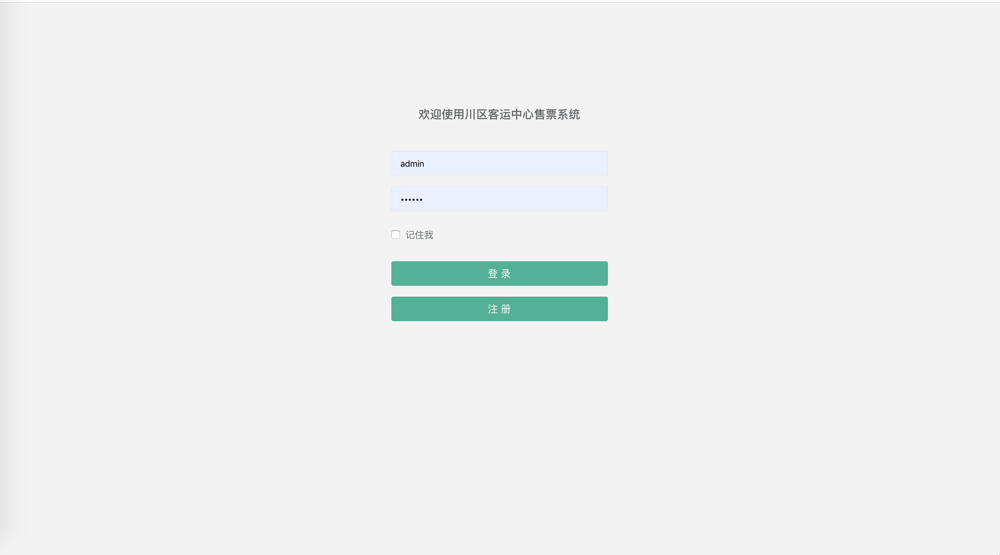

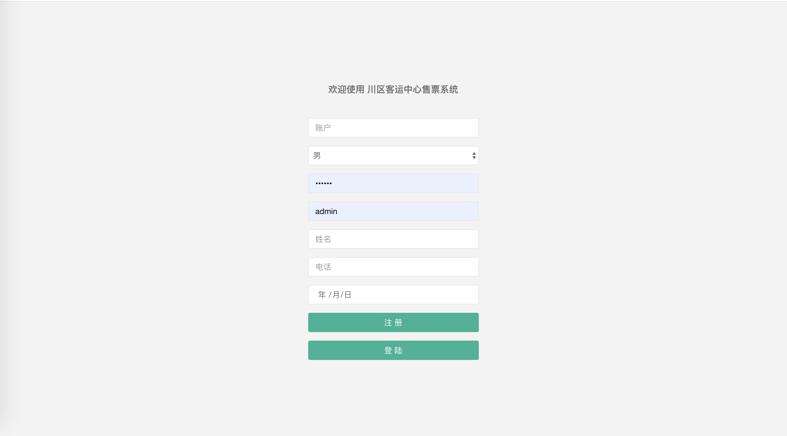

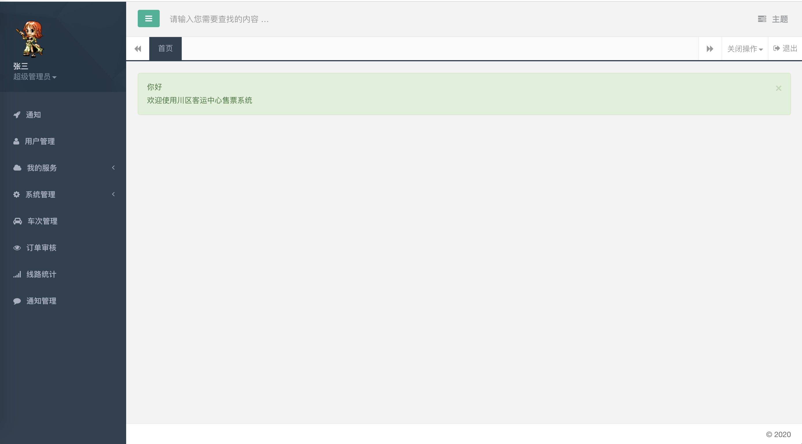

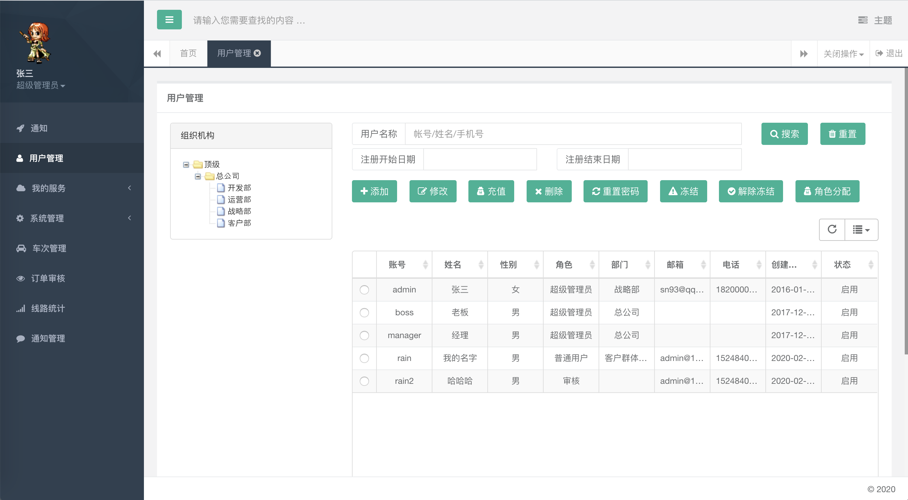

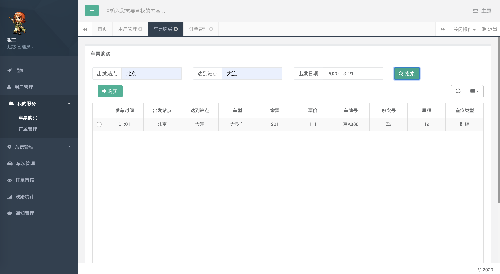

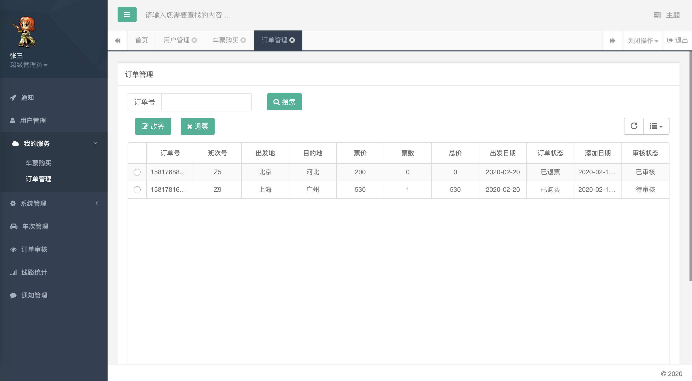

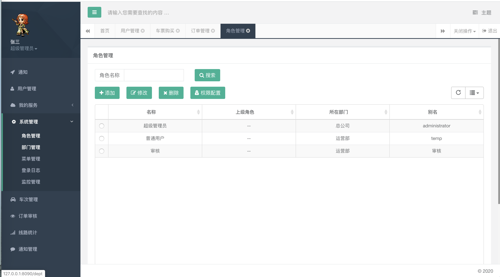

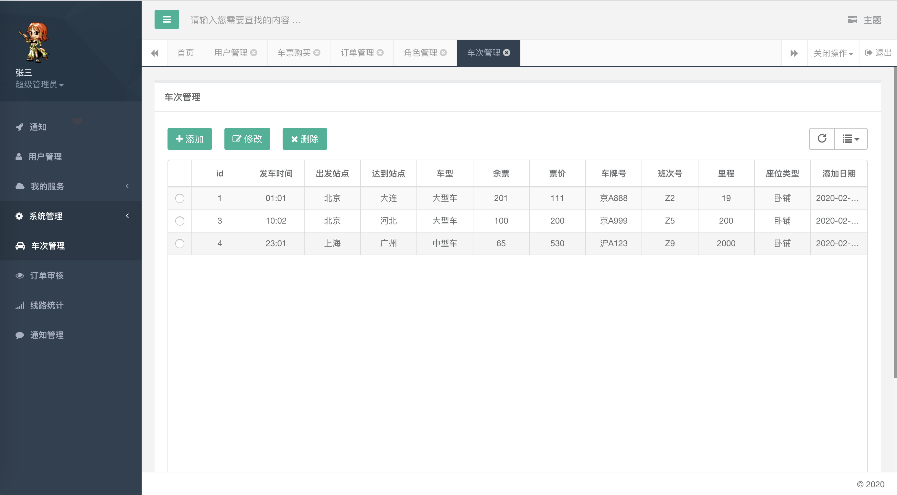

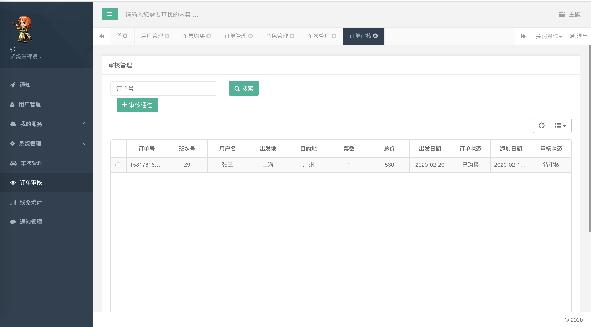

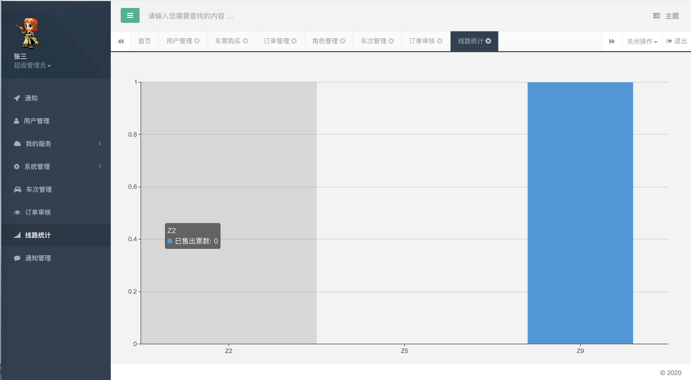

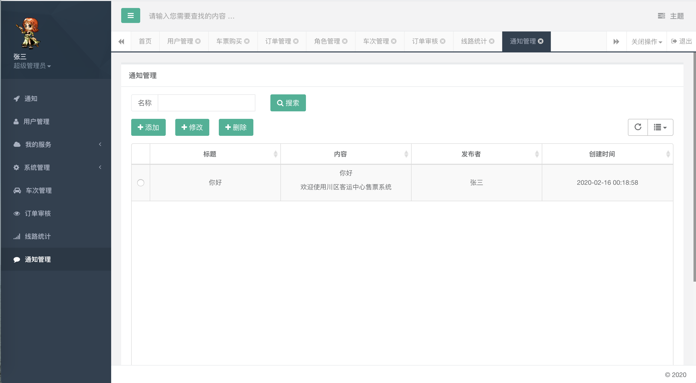